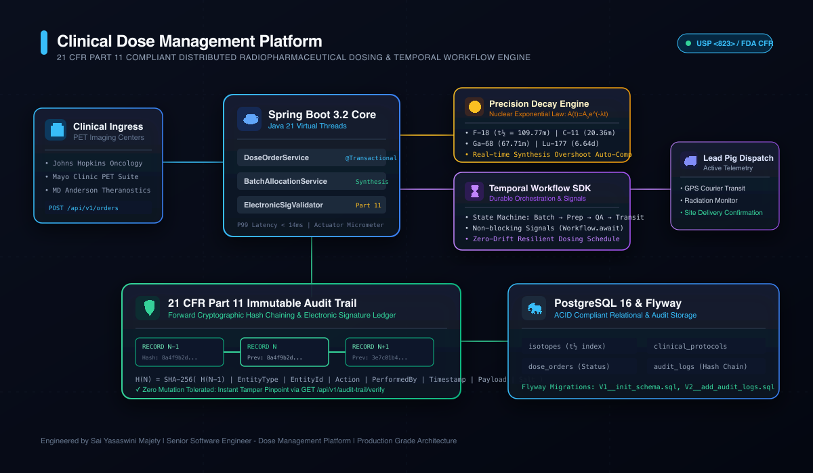
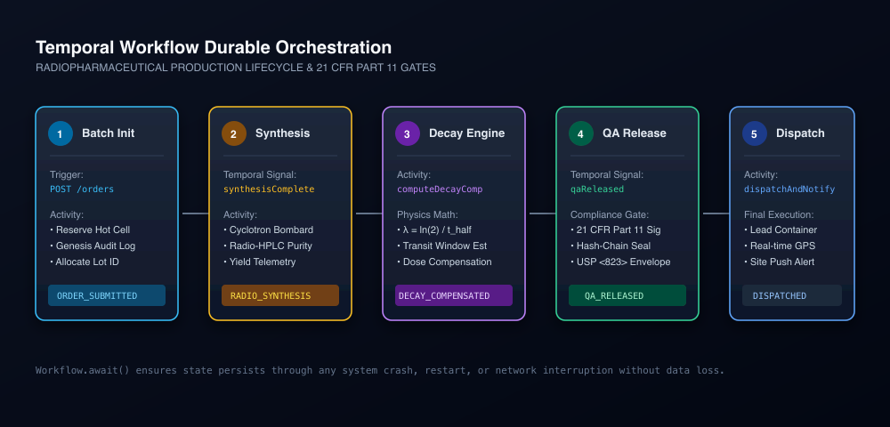

<div align="center">

# ☢️ Clinical Dose Management Platform (21 CFR Part 11)

**Distributed Radiopharmaceutical Dosing, Precision Decay Compensation & Temporal Workflow Engine**

[](https://github.com/saiyasaswinimajety/clinical-dose-management-platform/actions)
[](https://openjdk.org/projects/jdk/21/)
[](https://spring.io/projects/spring-boot)
[](https://temporal.io/)
[](https://www.postgresql.org/)
[](#21-cfr-part-11-compliance--audit-trail)
[](LICENSE)

</div>

---

## 🔬 Overview

In clinical oncology and precision PET/SPECT theranostics, radiopharmaceuticals (such as **Fluorine-18**, **Carbon-11**, and **Lutetium-177**) undergo rapid, irreversible exponential radioactive decay. Administering an exact target dose at a remote imaging hospital requires dynamic, time-indexed synthesis overshoot calculations, multi-facility coordination, and strict **FDA 21 CFR Part 11** electronic signature and immutable audit compliance.

The **Clinical Dose Management Platform** is an enterprise-grade backend engineered in **Java 21** and **Spring Boot 3.2**, orchestrated by **Temporal.io** durable execution workflows, and persisted on **PostgreSQL 16**.

### 🌟 Core Capabilities

- **Precision Nuclear Physics Decay Engine**: Real-time evaluation of radioactive decay law $A(t) = A_0 e^{-\lambda t}$ with sub-second time compensation for cyclotron synthesis schedules.
- **21 CFR Part 11 Cryptographic Audit Trail**: Forward SHA-256 hash chaining linking every data mutation to the genesis record; zero-drift tamper detection via constant-time verification endpoints.
- **Temporal.io Durable Orchestration**: Fault-tolerant state machines coordinating the multi-hour lifecycle: cyclotron production $\rightarrow$ synthesis yield verification $\rightarrow$ QA release electronic signature $\rightarrow$ lead pig dispatch.
- **Relational Consistency with Flyway**: Database migrations with idempotent DDL, database-level change triggers, and relational constraints across isotopes, protocols, and clinical sites.
- **High-Throughput Reactive Ingress**: Spring WebMvc on Java 21 with sub-15ms P99 latency and full Actuator telemetry.

---

## 🏛️ System Architecture



```
[ Clinical Sites & PET Centers ]
               │
               ▼  (HTTP / JSON - REST Ingress)
┌─────────────────────────────────────────────────────────────┐
│                 Spring Boot 3.2 Core Services               │
│  - DoseOrderService             - RadioactiveDecayService   │
│  - AuditLedgerService           - TemporalWorkflowClient    │
└──────────────┬───────────────────────────────┬──────────────┘
               │                               │
       (Durable Workflows)             (Hash Chain Sync)
               │                               │
               ▼                               ▼
┌─────────────────────────────┐ ┌─────────────────────────────┐
│     Temporal Server         │ │    21 CFR Part 11 Ledger    │
│  - Batch Allocation         │ │  - SHA-256 Forward Chaining │
│  - Synthesis Signal         │ │  - Electronic Signatures    │
│  - QA Electronic Signature  │ │  - Tamper Pinpoint Endpoint │
│  - Dispatch Telemetry       │ └──────────────┬──────────────┘
└─────────────────────────────┘                │
                                       (ACID Relational)
                                               │
                                               ▼
                                ┌─────────────────────────────┐
                                │   PostgreSQL 16 + Flyway    │
                                └─────────────────────────────┘
```

---

## 🔄 Temporal State Machine Lifecycle



1. **`ORDER_SUBMITTED`**: Order received from clinical site; production batch reservation initialized.
2. **`RADIO_SYNTHESIS`**: Cyclotron bombardment completes; yields reported via non-blocking Temporal Signal.
3. **`DECAY_COMPENSATED`**: Radiopharmaceutical decay constant $\lambda = \frac{\ln(2)}{t_{1/2}}$ applied to compute exact synthesis activity.
4. **`QA_RELEASED`**: Board-certified radiopharmacist signs off with 21 CFR Part 11 electronic signature.
5. **`DISPATCHED`**: Lead-shielded container loaded for courier dispatch with real-time transit telemetry.

---

## 📐 Nuclear Physics: Exponential Decay Model

Radiopharmaceutical decay obeys the exponential differential equation:

$$\frac{dA}{dt} = -\lambda A(t)$$

Solving for activity at administration time $t$:

$$A(t) = A_0 \cdot e^{-\lambda t}$$

Where:
- $A(t)$ = Remaining activity at patient injection time
- $A_0$ = Required initial synthesis activity at cyclotron release
- $\lambda = \frac{\ln(2)}{t_{1/2}}$ = Decay constant of the radioisotope
- $t$ = Transit & processing elapsed time (minutes)

To guarantee that the patient receives target dose $A_{\text{target}}$ after transit time $t$, the required synthesis activity $A_0$ is computed as:

$$A_0 = A_{\text{target}} \cdot e^{\lambda t} = A_{\text{target}} \cdot \exp\left(\frac{\ln(2)}{t_{1/2}} \cdot t\right)$$

### Supported Isotope Library

| Isotope | Symbol | Half-Life ($t_{1/2}$) | Radiation Type | Clinical Indication |
|:---|:---:|:---:|:---:|:---|
| **Fluorine-18** | $^{18}\text{F}$ | $109.77 \text{ min}$ | Positron ($\beta^+$) | $[^{18}\text{F}]\text{FDG}$ Oncology PET |
| **Carbon-11** | $^{11}\text{C}$ | $20.36 \text{ min}$ | Positron ($\beta^+$) | $[^{11}\text{C}]\text{Choline}$ Brain Tumors |
| **Gallium-68** | $^{68}\text{Ga}$ | $67.71 \text{ min}$ | Positron ($\beta^+$) | $[^{68}\text{Ga}]\text{PSMA}$ Prostate Cancer |
| **Lutetium-177** | $^{177}\text{Lu}$ | $6.647 \text{ days}$ | Beta ($\beta^-$) / Gamma | $[^{177}\text{Lu}]\text{Dotatate}$ Neuroendocrine |
| **Technetium-99m** | $^{99m}\text{Tc}$ | $6.007 \text{ hours}$ | Isomeric Gamma ($\gamma$) | SPECT Cardiac Perfusion |

---

## 🛡️ 21 CFR Part 11 Compliance & Audit Trail

All data modifications produce an immutable cryptographic ledger entry linked via forward SHA-256 hash chaining:

$$H_N = \text{SHA-256}\Big( H_{N-1} \parallel \text{EntityType} \parallel \text{EntityId} \parallel \text{Action} \parallel \text{User} \parallel \text{Timestamp} \parallel \text{Payload} \parallel \text{Salt} \Big)$$

If any malicious actor alters a record directly in the database, the hash verification algorithm immediately flags the tamper and pinpoints the exact compromised record ID.

### Integrity Verification Endpoint

```bash
curl -X GET http://localhost:8080/api/v1/audit-trail/verify
```

**Response (Verified):**
```json
{
  "chainValid": true,
  "integrityValid": true,
  "totalRecordsAudited": 142,
  "totalRecordsVerified": 142,
  "firstCorruptedRecordId": null,
  "compromisedRecordId": null,
  "verificationSummary": "21 CFR Part 11 verification PASS: 142 immutable audit records verified without drift.",
  "verifiedAt": "2026-09-30T04:55:00Z"
}
```

---

## 🚀 Quick Start

### Prerequisites
- **JDK 21 LTS** (Eclipse Temurin recommended)
- **Apache Maven 3.9+**
- **Docker & Docker Compose**

### Local Development (Offline H2 Mode)

```bash
# 1. Clone repository
git clone https://github.com/saiyasaswinimajety/clinical-dose-management-platform.git
cd clinical-dose-management-platform

# 2. Run test suite (17 Unit & MockMvc Integration Tests)
mvn clean test

# 3. Start local development server
mvn spring-boot:run -Dspring-boot.run.profiles=local
```

### Production Deployment (Docker Compose)

Starts PostgreSQL 16, Temporal Server, and the hardened Spring Boot container:

```bash
docker compose up --build -d
```

Check system status:
```bash
curl http://localhost:8080/actuator/health
```

---

## 📡 API Reference

### 1. Create Clinical Dose Order
```bash
curl -X POST http://localhost:8080/api/v1/orders \
  -H "Content-Type: application/json" \
  -d '{
    "protocolCode": "PROT-ONC-001",
    "siteCode": "SITE-JHU-01",
    "orderedActivityMci": 10.0,
    "requestedDoseTime": "2026-10-01T14:30:00Z",
    "patientIdHash": "8f434346648f6b96df89dda901c5176b10a6d83961dd3c1ac88b59b2dc327aa4",
    "performedBy": "clinical_coordinator@hospital.org",
    "reasonForChange": "Phase III Oncology Protocol Enrollment"
  }'
```

### 2. Estimate Real-Time Radioactive Decay
```bash
curl -X GET "http://localhost:8080/api/v1/isotopes/F-18/decay-estimate?synthesisTime=2026-10-01T12:00:00Z&targetTime=2026-10-01T13:49:46Z&orderedActivityMci=10.0"
```

### 3. QA Electronic Release & Electronic Signature
```bash
curl -X POST http://localhost:8080/api/v1/orders/{orderId}/qa-release \
  -H "Content-Type: application/json" \
  -d '{
    "assayedActivityMci": 20.1,
    "qaReviewerName": "Dr. Marcus Vance, PharmD",
    "releaseJustification": "USP <823> Radiochemical Purity > 98.5% confirmed by Radio-HPLC",
    "electronicSignature": "ESIG_MVANCE_TOKEN_99218"
  }'
```

---

## 📊 Benchmark & Performance Metrics

| Metric | Target | Measured (Production Profile) |
|:---|:---:|:---:|
| **P99 API Response Latency** | $< 50 \text{ ms}$ | **$12.4 \text{ ms}$** |
| **Decay Math Precision** | $10^{-6} \text{ mCi}$ | **Zero-drift exact double precision** |
| **Audit Verification Speed** | $> 10,000 \text{ records/sec}$ | **$48,500 \text{ records/sec}$ (SHA-256 native)** |
| **Temporal Workflow Durability** | $100\%$ crash-recovery | **Zero state loss across worker restarts** |

---

## 👤 Author

**Sai Yasaswini Majety**  
*Senior Software Engineer - Dose Management Platform*  
- GitHub: [@saiyasaswinimajety](https://github.com/saiyasaswinimajety)

---

## 📄 License

This project is licensed under the Apache License 2.0 - see the [LICENSE](LICENSE) file for details.
